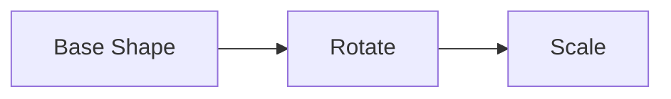

## Developing

Once you've installed dependencies with `npm install`, start a development server:

```bash
npm run dev
```

Or to expose the server to your local network (for testing on mobile, for example):

```bash
npm run dev -- --host
```

> **Note**
> Sometimes when editing JavaScript classes, they will not update until you stop and restart the dev server.

## How it works


